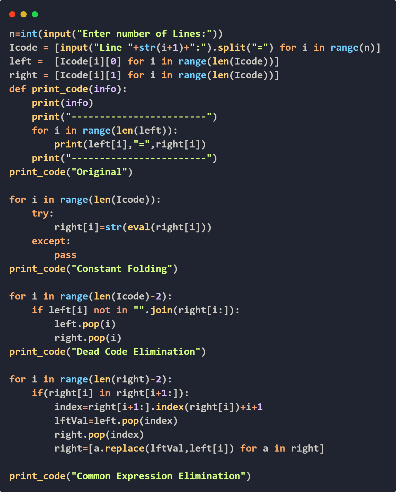
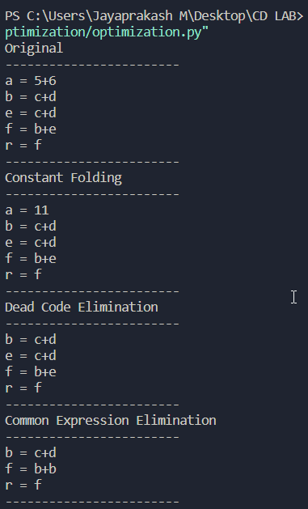

# Code Optimization

## Input FORMAT
THE INPUT SHOULD BE OF THE FOLLOWING FORM:
```
- Variable name should be single letter
- No space between each characters 
- <result>=<oprOne><Operator><oprTwo>
- a=b+c
```
## Output

