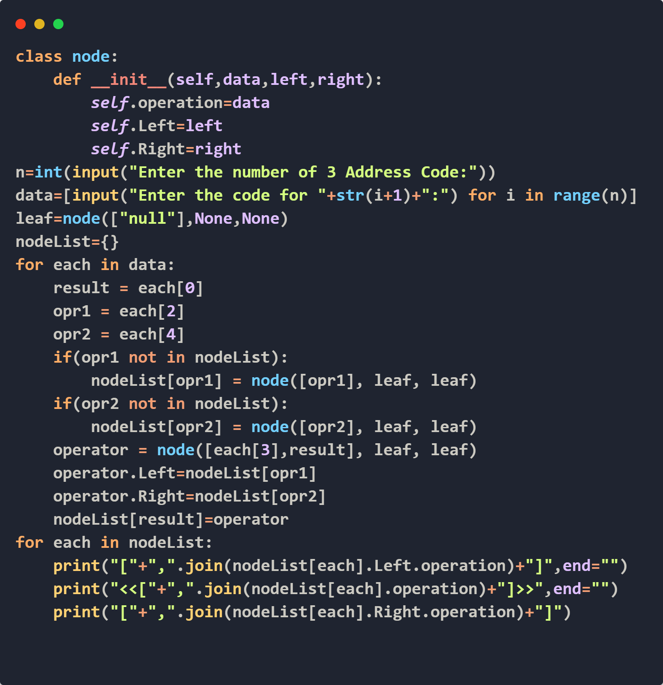
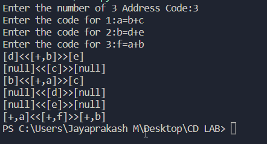

<h1> Construction of DAG </h1>

<h1> Input FORMAT </h1>

THE INPUT SHOULD BE OF THE FOLLOWING FORM:
- Variable name should be single letter
- No space between each characters 
- <result>=<oprOne><Operator><oprTwo>
- a=b+c

<h1> Output </h1>

